# PSF Website & Portal: Flow Diagrams and ERD

Pakistan Strategic Forum | Companion to `PSF-FRD-User-Flows.md` v1.0 Draft, 16 Oct 2026

Diagrams are written in Mermaid so they render in GitHub, Notion, most Markdown editors and can be pasted into FigJam (Mermaid import) or mermaid.live. Section references (for example "9.5") point to the FRD.

## Contents

1. Platform map
2. Visitor journey (public site)
3. Contributor signup with OTP
4. Admin application review
5. Invite and set password (admin-created accounts)
6. Sign-in routing by account status
7. Article and report submission and editorial decision
8. Research paper lifecycle (double-blind)
9. Approver review workflow
10. Newsroom post
11. Featured and Top Stories scheduling and holding rule
12. Ad campaign booking, conflict check and reporting
13. User moderation: deactivate and ban
14. Global Watch globe interaction
15. ID card creation and verification
16. CMS draft, preview, publish
17. Public forms to Inbox
18. Read counting
19. State diagram: user account
20. State diagram: article and report
21. State diagram: research paper
22. Entity relationship diagram (database), full and by domain

---

## 1. Platform map

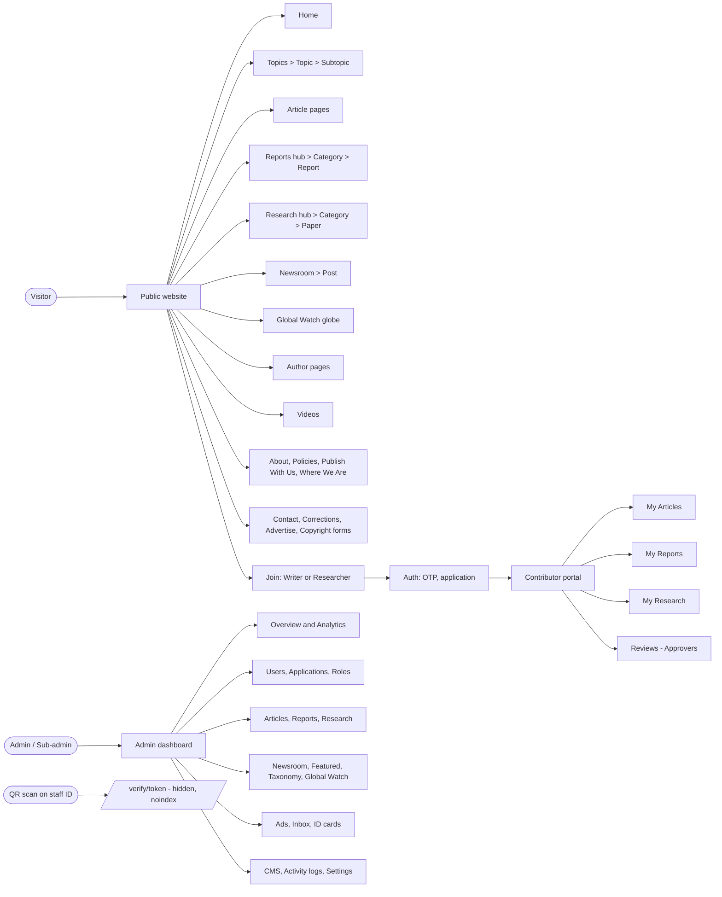
```mermaid
flowchart LR
  V([Visitor]) --> PUB[Public website]
  PUB --> HOME[Home]
  PUB --> TOP[Topics > Topic > Subtopic]
  PUB --> ART[Article pages]
  PUB --> REP[Reports hub > Category > Report]
  PUB --> RES[Research hub > Category > Paper]
  PUB --> NEWS[Newsroom > Post]
  PUB --> GW[Global Watch globe]
  PUB --> AUTH[Author pages]
  PUB --> VID[Videos]
  PUB --> INFO[About, Policies, Publish With Us, Where We Are]
  PUB --> FORMS[Contact, Corrections, Advertise, Copyright forms]
  PUB --> JOIN[Join: Writer or Researcher]
  JOIN --> AUTHN[Auth: OTP, application]
  AUTHN --> PORTAL[Contributor portal]
  PORTAL --> MYA[My Articles]
  PORTAL --> MYR[My Reports]
  PORTAL --> MYP[My Research]
  PORTAL --> REV[Reviews - Approvers]
  ADMINU([Admin / Sub-admin]) --> ADM[Admin dashboard]
  ADM --> A1[Overview and Analytics]
  ADM --> A2[Users, Applications, Roles]
  ADM --> A3[Articles, Reports, Research]
  ADM --> A4[Newsroom, Featured, Taxonomy, Global Watch]
  ADM --> A5[Ads, Inbox, ID cards]
  ADM --> A6[CMS, Activity logs, Settings]
  Q([QR scan on staff ID]) --> VER[/verify/token - hidden, noindex/]
```

## 2. Visitor journey (public site)

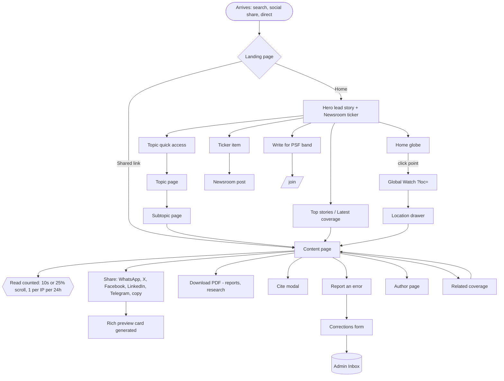
```mermaid
flowchart TD
  S([Arrives: search, social share, direct]) --> L{Landing page}
  L -->|Home| H[Hero lead story + Newsroom ticker]
  L -->|Shared link| C[Content page]
  H --> QA[Topic quick access] --> TP[Topic page] --> SP[Subtopic page] --> C
  H --> TS[Top stories / Latest coverage] --> C
  H --> G[Home globe] -->|click point| GW[Global Watch ?loc=] --> DR[Location drawer] --> C
  H --> TK[Ticker item] --> NP[Newsroom post]
  C --> RD{{Read counted: 10s or 25% scroll, 1 per IP per 24h}}
  C --> SH[Share: WhatsApp, X, Facebook, LinkedIn, Telegram, copy] --> CARD[Rich preview card generated]
  C --> PDF[Download PDF - reports, research]
  C --> CITE[Cite modal]
  C --> ERR[Report an error] --> CORR[Corrections form] --> INBOX[(Admin Inbox)]
  C --> AU[Author page]
  C --> REL[Related coverage] --> C
  H --> W[Write for PSF band] --> J[/join/]
```

## 3. Contributor signup with OTP (FRD 9.3 to 9.8)

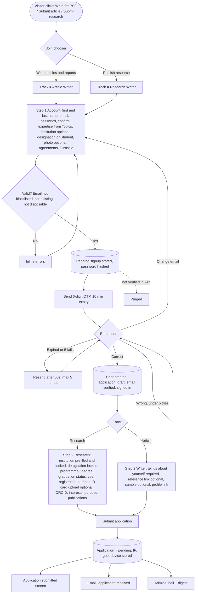
```mermaid
flowchart TD
  A([Visitor clicks Write for PSF / Submit article / Submit research]) --> CH{Join chooser}
  CH -->|Write articles and reports| T1[Track = Article Writer]
  CH -->|Publish research| T2[Track = Research Writer]
  T1 --> S1
  T2 --> S1
  S1["Step 1 Account: first and last name, email, password, confirm, expertise from Topics, institution optional, designation or Student, photo optional, agreements, Turnstile"] --> V1{Valid? Email not blocklisted, not existing, not disposable}
  V1 -->|No| S1E[Inline errors] --> S1
  V1 -->|Yes| PS[(Pending signup stored, password hashed)] --> OTP[Send 6-digit OTP, 10 min expiry]
  OTP --> E{Enter code}
  E -->|Wrong, under 5 tries| E
  E -->|Expired or 5 fails| RS[Resend after 60s, max 5 per hour] --> E
  E -->|Change email| S1
  E -->|Correct| U[(User created: application_draft, email verified, signed in)]
  U --> TR{Track}
  TR -->|Research| R2["Step 2 Research: institution prefilled and locked, designation locked, programme / degree, graduation status, year, registration number, ID card upload optional, ORCID, interests, purpose, publications"]
  TR -->|Article| W2["Step 2 Writer: tell us about yourself required, reference link optional, sample optional, profile link"]
  R2 --> SUB[Submit application]
  W2 --> SUB
  SUB --> AP[(Application = pending; IP, geo, device stored)]
  AP --> OK[Application submitted screen]
  AP --> M1[Email: application received]
  AP --> M2[Admins: bell + digest]
  PS -. not verified in 24h .-> X[Purged]
```

## 4. Admin application review (FRD 12.5)

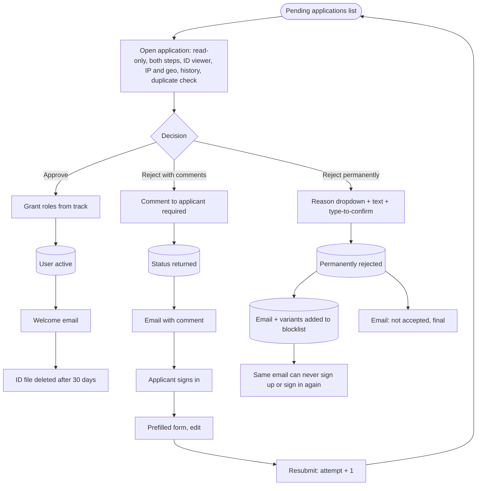
```mermaid
flowchart TD
  N([Pending applications list]) --> O[Open application: read-only, both steps, ID viewer, IP and geo, history, duplicate check]
  O --> D{Decision}
  D -->|Approve| AP[Grant roles from track] --> ACT[(User active)] --> WE[Welcome email] --> DEL[ID file deleted after 30 days]
  D -->|Reject with comments| RC[Comment to applicant required] --> RET[(Status returned)] --> EM[Email with comment]
  EM --> UL[Applicant signs in] --> PF[Prefilled form, edit] --> RES[Resubmit: attempt + 1] --> N
  D -->|Reject permanently| RP[Reason dropdown + text + type-to-confirm] --> PR[(Permanently rejected)]
  PR --> BL[(Email + variants added to blocklist)]
  PR --> EM2[Email: not accepted, final]
  BL --> NO[Same email can never sign up or sign in again]
```

## 5. Invite and set password (FRD 9.10, 12.4.4)

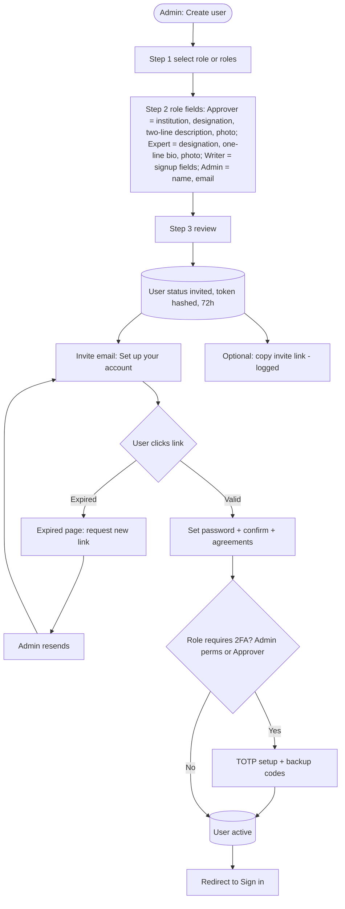
```mermaid
flowchart TD
  A([Admin: Create user]) --> R[Step 1 select role or roles]
  R --> F["Step 2 role fields: Approver = institution, designation, two-line description, photo; Expert = designation, one-line bio, photo; Writer = signup fields; Admin = name, email"]
  F --> RV[Step 3 review] --> INV[(User status invited, token hashed, 72h)]
  INV --> EM[Invite email: Set up your account]
  INV --> CP[Optional: copy invite link - logged]
  EM --> CL{User clicks link}
  CL -->|Expired| EXP[Expired page: request new link] --> ADM[Admin resends] --> EM
  CL -->|Valid| SP[Set password + confirm + agreements]
  SP --> TFA{Role requires 2FA? Admin perms or Approver}
  TFA -->|Yes| SETUP[TOTP setup + backup codes] --> ACT
  TFA -->|No| ACT[(User active)]
  ACT --> SI[Redirect to Sign in]
```

## 6. Sign-in routing by account status (FRD 9.2)

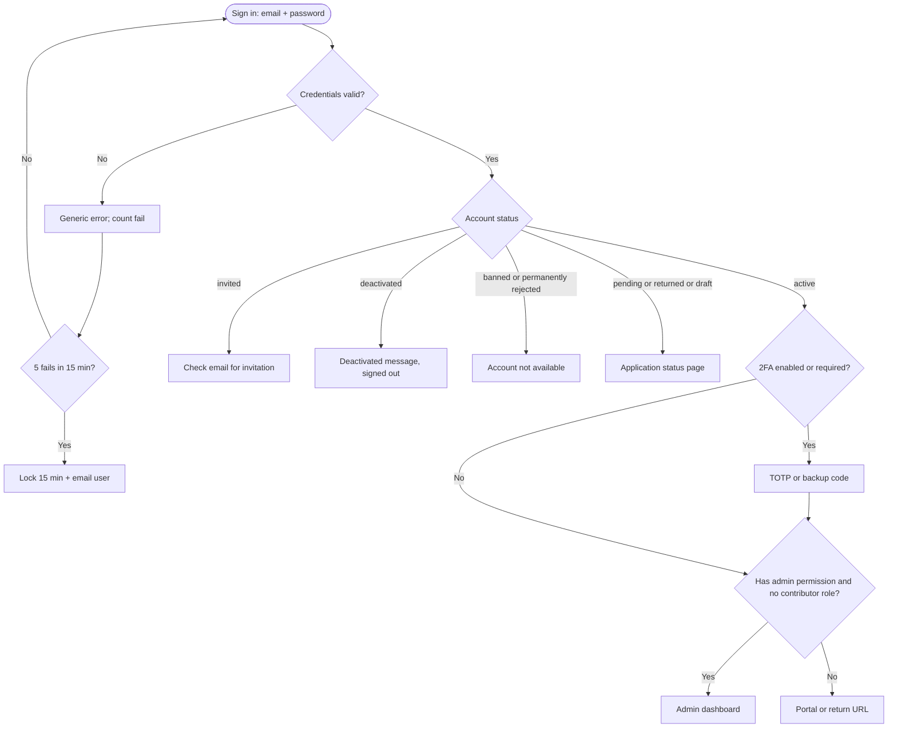
```mermaid
flowchart TD
  S([Sign in: email + password]) --> C{Credentials valid?}
  C -->|No| F[Generic error; count fail] --> L{5 fails in 15 min?}
  L -->|Yes| LOCK[Lock 15 min + email user]
  L -->|No| S
  C -->|Yes| ST{Account status}
  ST -->|invited| INV[Check email for invitation]
  ST -->|deactivated| DEA[Deactivated message, signed out]
  ST -->|banned or permanently rejected| BAN[Account not available]
  ST -->|pending or returned or draft| APP["Application status page"]
  ST -->|active| T{2FA enabled or required?}
  T -->|Yes| TF[TOTP or backup code] --> RT
  T -->|No| RT{Has admin permission and no contributor role?}
  RT -->|Yes| ADMIN["Admin dashboard"]
  RT -->|No| PORTAL["Portal or return URL"]
```

## 7. Article and report submission and editorial decision (FRD 10.4, 10.5, 12.7)

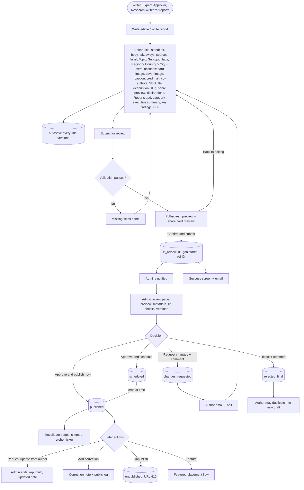
```mermaid
flowchart TD
  W([Writer, Expert, Approver, Research Writer for reports]) --> N[Write article / Write report]
  N --> ED["Editor: title, standfirst, body, takeaways, sources; label, Topic, Subtopic, tags; Region > Country > City + extra locations; card image, cover image, caption, credit, alt; co-authors; SEO title, description, slug, share preview; declarations. Reports add: category, executive summary, key findings, PDF"]
  ED --> AS[(Autosave every 10s, versions)]
  ED --> SUBM[Submit for review] --> VAL{Validation passes?}
  VAL -->|No| MF[Missing fields panel] --> ED
  VAL -->|Yes| PV[Full-screen preview + share card preview]
  PV -->|Back to editing| ED
  PV -->|Confirm and submit| IR[(in_review; IP, geo stored; ref ID)]
  IR --> NA[Admins notified] --> RV[Admin review page: preview, metadata, IP, checks, versions]
  IR --> SC[Success screen + email]
  RV --> DEC{Decision}
  DEC -->|Approve and publish now| PUB[(published)] --> RV2[Revalidate pages, sitemap, globe, ticker]
  DEC -->|Approve and schedule| SCH[(scheduled)] -->|cron at time| PUB
  DEC -->|Request changes + comment| CR[(changes_requested)] --> EMA[Author email + bell] --> ED
  DEC -->|Reject + comment| REJ[(rejected, final)] --> DUP[Author may duplicate into new draft]
  PUB --> LIVE{Later actions}
  LIVE -->|Request update from author| UR[Admin edits, republish, Updated note]
  LIVE -->|Add correction| CO[Correction note + public log]
  LIVE -->|Unpublish| UN[(unpublished, URL 410)]
  LIVE -->|Feature| FE[Featured placement flow]
```

## 8. Research paper lifecycle, double-blind (FRD 10.6, 11, 12.8)

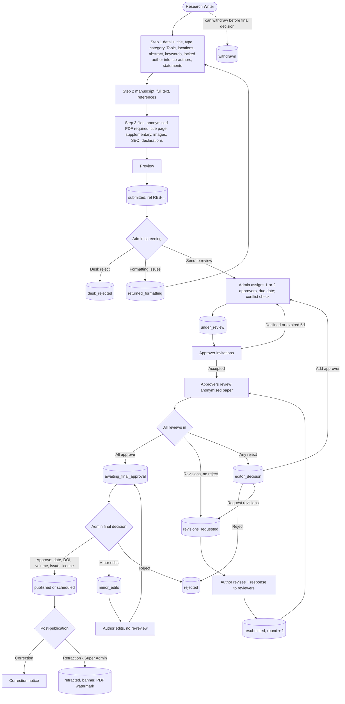
```mermaid
flowchart TD
  A([Research Writer]) --> S1[Step 1 details: title, type, category, Topic, locations, abstract, keywords, locked author info, co-authors, statements]
  S1 --> S2[Step 2 manuscript: full text, references]
  S2 --> S3[Step 3 files: anonymised PDF required, title page, supplementary, images, SEO, declarations]
  S3 --> PV[Preview] --> SUB[(submitted, ref RES-...)]
  SUB --> SCR{Admin screening}
  SCR -->|Desk reject| DR[(desk_rejected)]
  SCR -->|Formatting issues| RF[(returned_formatting)] --> S1
  SCR -->|Send to review| AS[Admin assigns 1 or 2 approvers, due date; conflict check]
  AS --> UR[(under_review)] --> INV[Approver invitations]
  INV -->|Declined or expired 5d| AS
  INV -->|Accepted| REV[Approvers review anonymised paper]
  REV --> ALL{All reviews in}
  ALL -->|All approve| FA[(awaiting_final_approval)]
  ALL -->|Revisions, no reject| RR[(revisions_requested)]
  ALL -->|Any reject| ED[(editor_decision)]
  ED -->|Reject| REJ[(rejected)]
  ED -->|Request revisions| RR
  ED -->|Add approver| AS
  RR --> AU[Author revises + response to reviewers] --> RS[(resubmitted, round + 1)] --> REV
  FA --> FD{Admin final decision}
  FD -->|Approve: date, DOI, volume, issue, licence| PUB[(published or scheduled)]
  FD -->|Minor edits| ME[(minor_edits)] --> AU2[Author edits, no re-review] --> FA
  FD -->|Reject| REJ
  PUB --> POST{Post-publication}
  POST -->|Correction| COR[Correction notice]
  POST -->|Retraction - Super Admin| RET[(retracted, banner, PDF watermark)]
  A -. can withdraw before final decision .-> WD[(withdrawn)]
```

## 9. Approver review workflow (FRD 11)

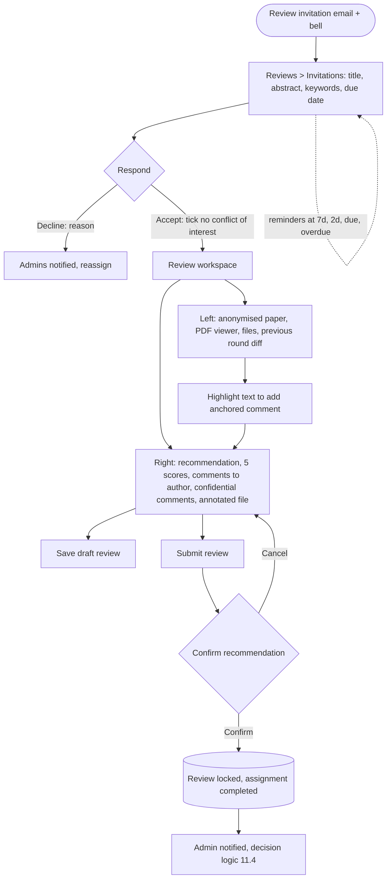
```mermaid
flowchart TD
  I([Review invitation email + bell]) --> Q[Reviews > Invitations: title, abstract, keywords, due date]
  Q --> D{Respond}
  D -->|Decline: reason| DC[Admins notified, reassign]
  D -->|Accept: tick no conflict of interest| W[Review workspace]
  W --> P[Left: anonymised paper, PDF viewer, files, previous round diff]
  W --> F[Right: recommendation, 5 scores, comments to author, confidential comments, annotated file]
  P --> HL[Highlight text to add anchored comment] --> F
  F --> SD[Save draft review]
  F --> SB[Submit review] --> CF{Confirm recommendation}
  CF -->|Cancel| F
  CF -->|Confirm| LK[(Review locked, assignment completed)] --> ADM[Admin notified, decision logic 11.4]
  Q -. reminders at 7d, 2d, due, overdue .-> Q
```

## 10. Newsroom post (FRD 12.9, 7.2)

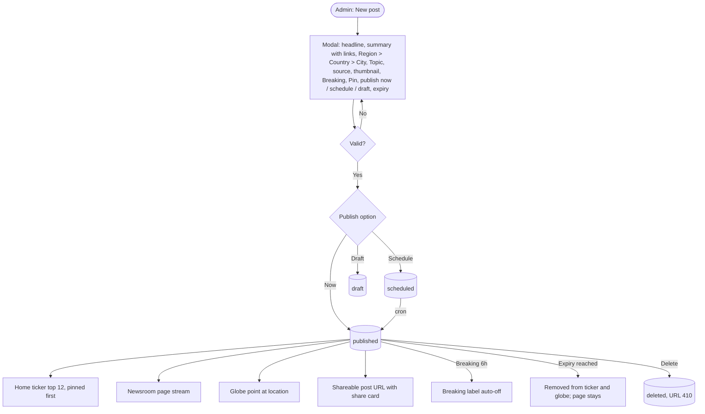
```mermaid
flowchart TD
  A([Admin: New post]) --> M["Modal: headline, summary with links, Region > Country > City, Topic, source, thumbnail, Breaking, Pin, publish now / schedule / draft, expiry"]
  M --> V{Valid?}
  V -->|No| M
  V -->|Yes| P{Publish option}
  P -->|Now| L[(published)]
  P -->|Schedule| S[(scheduled)] -->|cron| L
  P -->|Draft| D[(draft)]
  L --> T[Home ticker top 12, pinned first]
  L --> NP[Newsroom page stream]
  L --> G[Globe point at location]
  L --> PG[Shareable post URL with share card]
  L -->|Breaking 6h| BO[Breaking label auto-off]
  L -->|Expiry reached| EX[Removed from ticker and globe; page stays]
  L -->|Delete| X[(deleted, URL 410)]
```

## 11. Featured and Top Stories scheduling and holding rule (FRD 12.10, 14)

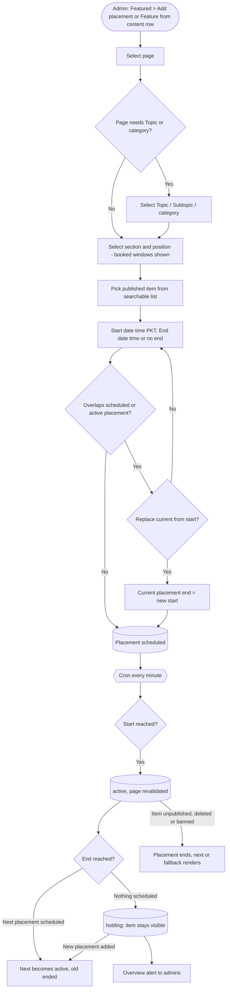
```mermaid
flowchart TD
  A([Admin: Featured > Add placement or Feature from content row]) --> P1[Select page]
  P1 --> P2{Page needs Topic or category?}
  P2 -->|Yes| P3[Select Topic / Subtopic / category]
  P2 -->|No| P4
  P3 --> P4[Select section and position - booked windows shown]
  P4 --> P5[Pick published item from searchable list]
  P5 --> P6[Start date time PKT, End date time or no end]
  P6 --> C{Overlaps scheduled or active placement?}
  C -->|Yes| R{Replace current from start?}
  R -->|No| P6
  R -->|Yes| E1[Current placement end = new start]
  C -->|No| OK[(Placement scheduled)]
  E1 --> OK
  OK --> CRON{{Cron every minute}}
  CRON --> ST{Start reached?} -->|Yes| ACT[(active, page revalidated)]
  ACT --> EN{End reached?}
  EN -->|Next placement scheduled| NX[Next becomes active, old ended]
  EN -->|Nothing scheduled| HO[(holding: item stays visible)] --> AL[Overview alert to admins]
  HO -->|New placement added| NX
  ACT -->|Item unpublished, deleted or banned| FB[Placement ends, next or fallback renders]
```

## 12. Ad campaign booking, conflict check and reporting (FRD 12.13, 15)

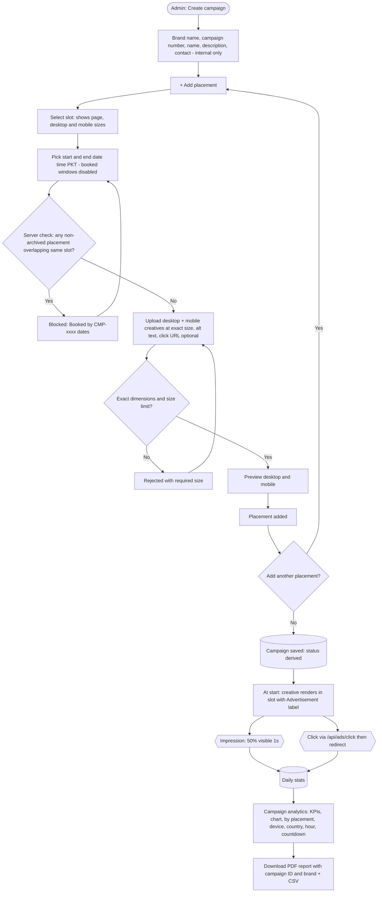
```mermaid
flowchart TD
  A([Admin: Create campaign]) --> F[Brand name, campaign number, name, description, contact - internal only]
  F --> AP[+ Add placement]
  AP --> S1[Select slot: shows page, desktop and mobile sizes]
  S1 --> S2[Pick start and end date time PKT - booked windows disabled]
  S2 --> CHK{Server check: any non-archived placement overlapping same slot?}
  CHK -->|Yes| BLK[Blocked: Booked by CMP-xxxx dates] --> S2
  CHK -->|No| S3[Upload desktop + mobile creatives at exact size, alt text, click URL optional]
  S3 --> VS{Exact dimensions and size limit?}
  VS -->|No| ERR[Rejected with required size] --> S3
  VS -->|Yes| S4[Preview desktop and mobile] --> ADD[Placement added]
  ADD --> MORE{Add another placement?}
  MORE -->|Yes| AP
  MORE -->|No| SAVE[(Campaign saved: status derived)]
  SAVE --> LIVE[At start: creative renders in slot with Advertisement label]
  LIVE --> IMP{{Impression: 50% visible 1s}}
  LIVE --> CLK{{Click via /api/ads/click then redirect}}
  IMP --> STATS[(Daily stats)]
  CLK --> STATS
  STATS --> AN[Campaign analytics: KPIs, chart, by placement, device, country, hour, countdown]
  AN --> PDF[Download PDF report with campaign ID and brand + CSV]
```

## 13. User moderation: deactivate and ban (FRD 12.4.5, 12.4.6)

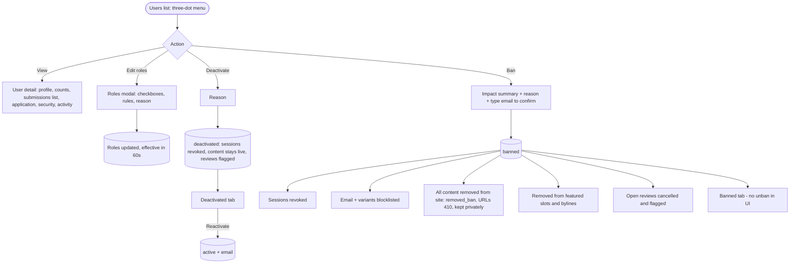
```mermaid
flowchart TD
  U([Users list: three-dot menu]) --> M{Action}
  M -->|View| D[User detail: profile, counts, submissions list, application, security, activity]
  M -->|Edit roles| ER[Roles modal: checkboxes, rules, reason] --> RL[(Roles updated, effective in 60s)]
  M -->|Deactivate| DA[Reason] --> DS[(deactivated: sessions revoked, content stays live, reviews flagged)]
  DS --> TAB1[Deactivated tab] -->|Reactivate| AC[(active + email)]
  M -->|Ban| B[Impact summary + reason + type email to confirm]
  B --> BS[(banned)]
  BS --> B1[Sessions revoked]
  BS --> B2[Email + variants blocklisted]
  BS --> B3[All content removed from site: removed_ban, URLs 410, kept privately]
  BS --> B4[Removed from featured slots and bylines]
  BS --> B5[Open reviews cancelled and flagged]
  BS --> TAB2[Banned tab - no unban in UI]
```

## 14. Global Watch globe interaction (FRD 8)

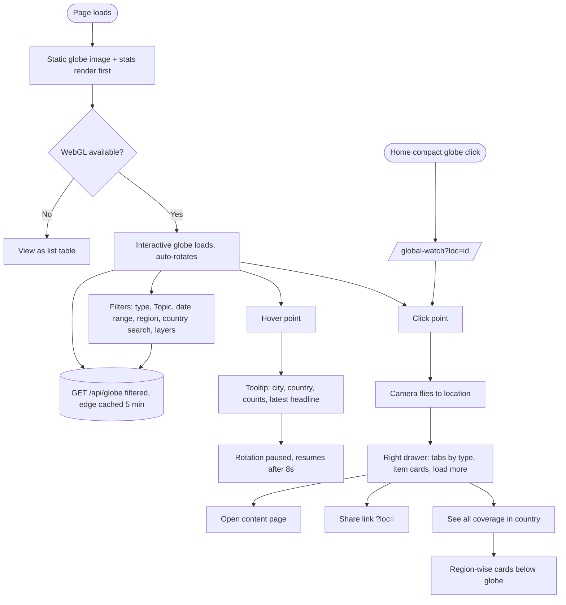
```mermaid
flowchart TD
  P([Page loads]) --> ST[Static globe image + stats render first]
  ST --> W{WebGL available?}
  W -->|No| LIST[View as list table]
  W -->|Yes| GL[Interactive globe loads, auto-rotates]
  GL --> DATA[(GET /api/globe filtered, edge cached 5 min)]
  GL --> H[Hover point] --> TT[Tooltip: city, country, counts, latest headline] --> R[Rotation paused, resumes after 8s]
  GL --> F[Filters: type, Topic, date range, region, country search, layers] --> DATA
  GL --> CK[Click point] --> FLY[Camera flies to location] --> DR[Right drawer: tabs by type, item cards, load more]
  DR --> ITEM[Open content page]
  DR --> SHARE[Share link ?loc=]
  DR --> RC[See all coverage in country] --> CARDS[Region-wise cards below globe]
  HOMEG([Home compact globe click]) --> URL[/global-watch?loc=id/] --> CK
```

## 15. ID card creation and verification (FRD 7.24, 12.15)

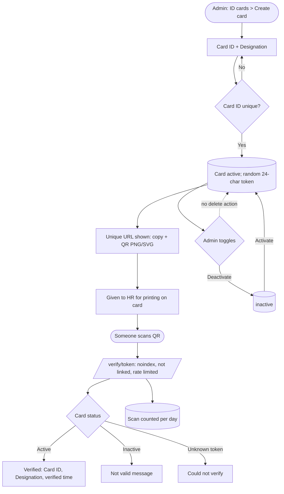
```mermaid
flowchart TD
  A([Admin: ID cards > Create card]) --> F[Card ID + Designation]
  F --> V{Card ID unique?}
  V -->|No| F
  V -->|Yes| G[(Card active; random 24-char token)] --> URL[Unique URL shown: copy + QR PNG/SVG]
  URL --> HR[Given to HR for printing on card]
  HR --> SCAN([Someone scans QR]) --> PG[/verify/token: noindex, not linked, rate limited/]
  PG --> S{Card status}
  S -->|Active| OK[Verified: Card ID, Designation, verified time]
  S -->|Inactive| NO[Not valid message]
  S -->|Unknown token| UK[Could not verify]
  PG --> LOG[(Scan counted per day)]
  G --> T{Admin toggles}
  T -->|Deactivate| IN[(inactive)] -->|Activate| G
  T -. no delete action .-> G
```

## 16. CMS draft, preview, publish (FRD 12.16)

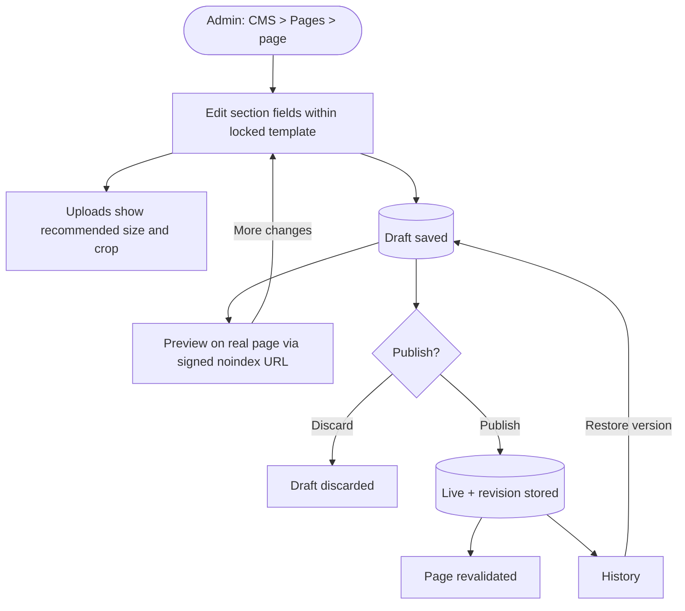
```mermaid
flowchart TD
  A([Admin: CMS > Pages > page]) --> ED[Edit section fields within locked template]
  ED --> UP[Uploads show recommended size and crop]
  ED --> DR[(Draft saved)]
  DR --> PV[Preview on real page via signed noindex URL]
  PV -->|More changes| ED
  DR --> PB{Publish?}
  PB -->|Discard| X[Draft discarded]
  PB -->|Publish| LV[(Live + revision stored)] --> RV[Page revalidated]
  LV --> HI[History] -->|Restore version| DR
```

## 17. Public forms to Inbox (FRD 7.18, 7.21, 7.22, 12.14)

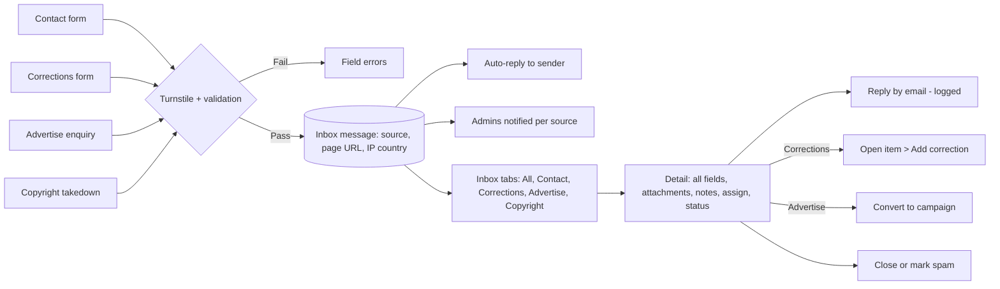
```mermaid
flowchart LR
  C1[Contact form] --> T{Turnstile + validation}
  C2[Corrections form] --> T
  C3[Advertise enquiry] --> T
  C4[Copyright takedown] --> T
  T -->|Fail| E[Field errors]
  T -->|Pass| IN[(Inbox message: source, page URL, IP country)]
  IN --> AR[Auto-reply to sender]
  IN --> NT[Admins notified per source]
  IN --> TABS[Inbox tabs: All, Contact, Corrections, Advertise, Copyright]
  TABS --> DET[Detail: all fields, attachments, notes, assign, status]
  DET --> RP[Reply by email - logged]
  DET -->|Corrections| LINK[Open item > Add correction]
  DET -->|Advertise| CMP[Convert to campaign]
  DET --> CL[Close or mark spam]
```

## 18. Read counting (FRD 17.1)

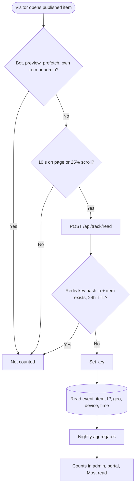
```mermaid
flowchart TD
  V([Visitor opens published item]) --> B{Bot, preview, prefetch, own item or admin?}
  B -->|Yes| NO[Not counted]
  B -->|No| W{10 s on page or 25% scroll?}
  W -->|No| NO
  W -->|Yes| BEACON[POST /api/track/read]
  BEACON --> K{Redis key hash ip + item exists, 24h TTL?}
  K -->|Yes| NO
  K -->|No| SET[Set key] --> EV[(Read event: item, IP, geo, device, time)]
  EV --> AGG[Nightly aggregates] --> DASH[Counts in admin, portal, Most read]
```

## 19. State diagram: user account

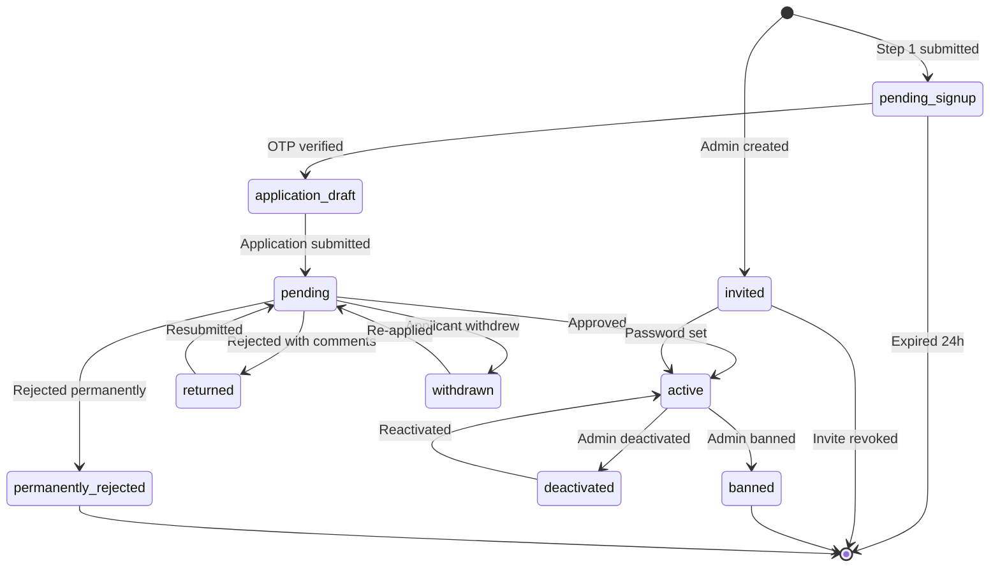
```mermaid
stateDiagram-v2
  [*] --> pending_signup: Step 1 submitted
  pending_signup --> application_draft: OTP verified
  pending_signup --> [*]: Expired 24h
  application_draft --> pending: Application submitted
  pending --> active: Approved
  pending --> returned: Rejected with comments
  returned --> pending: Resubmitted
  pending --> permanently_rejected: Rejected permanently
  pending --> withdrawn: Applicant withdrew
  withdrawn --> pending: Re-applied
  [*] --> invited: Admin created
  invited --> active: Password set
  invited --> [*]: Invite revoked
  active --> deactivated: Admin deactivated
  deactivated --> active: Reactivated
  active --> banned: Admin banned
  banned --> [*]
  permanently_rejected --> [*]
```

## 20. State diagram: article and report

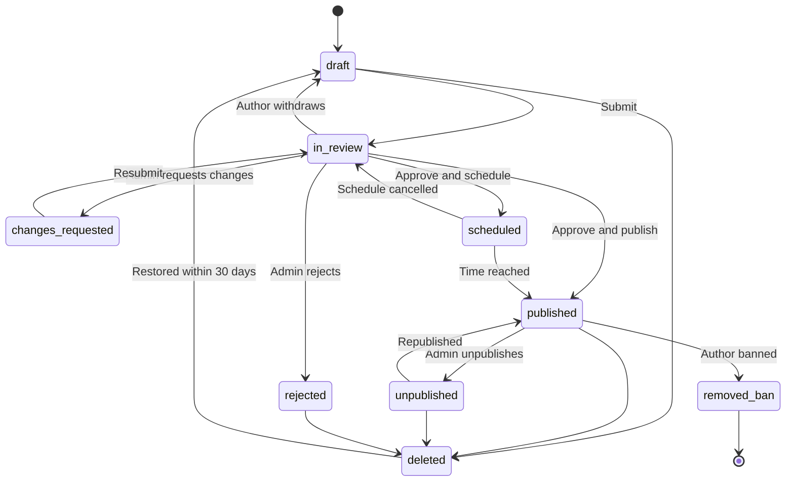
```mermaid
stateDiagram-v2
  [*] --> draft
  draft --> in_review: Submit
  in_review --> draft: Author withdraws
  in_review --> changes_requested: Admin requests changes
  changes_requested --> in_review: Resubmit
  in_review --> rejected: Admin rejects
  in_review --> scheduled: Approve and schedule
  in_review --> published: Approve and publish
  scheduled --> published: Time reached
  scheduled --> in_review: Schedule cancelled
  published --> unpublished: Admin unpublishes
  unpublished --> published: Republished
  draft --> deleted
  published --> deleted
  unpublished --> deleted
  rejected --> deleted
  deleted --> draft: Restored within 30 days
  published --> removed_ban: Author banned
  removed_ban --> [*]
```

## 21. State diagram: research paper

```mermaid
stateDiagram-v2
  [*] --> draft
  draft --> submitted
  submitted --> desk_rejected
  submitted --> returned_formatting
  returned_formatting --> submitted
  submitted --> under_review: Approvers assigned
  under_review --> awaiting_final_approval: All approve
  under_review --> revisions_requested: Revisions recommended
  under_review --> editor_decision: Reject recommended
  editor_decision --> rejected
  editor_decision --> revisions_requested
  editor_decision --> under_review: Extra approver
  revisions_requested --> resubmitted
  resubmitted --> under_review: Next round
  awaiting_final_approval --> minor_edits
  minor_edits --> awaiting_final_approval
  awaiting_final_approval --> scheduled
  awaiting_final_approval --> published
  awaiting_final_approval --> rejected
  scheduled --> published
  published --> unpublished
  published --> retracted
  submitted --> withdrawn
  under_review --> withdrawn
  revisions_requested --> withdrawn
  desk_rejected --> [*]
  rejected --> [*]
  withdrawn --> [*]
```

## 22. Entity relationship diagram

Key: PK primary key, FK foreign key, UK unique. Common columns `createdAt`, `updatedAt`, `deletedAt` omitted unless meaningful. All IDs are `cuid` strings except log and event IDs (bigint).

```mermaid
erDiagram
  USER ||--|| USER_PROFILE : has
  USER ||--o{ USER_ROLE : holds
  ROLE ||--o{ USER_ROLE : assigned
  ROLE ||--o{ ROLE_PERMISSION : grants
  PERMISSION ||--o{ ROLE_PERMISSION : included
  USER ||--o{ SESSION : signs_in
  USER ||--o| TWO_FACTOR : secures
  USER ||--o{ INVITE : receives
  USER ||--o{ APPLICATION : submits
  APPLICATION ||--o{ APPLICATION_DOCUMENT : attaches
  APPLICATION ||--o{ APPLICATION_DECISION : decided_by
  USER ||--o{ CONTENT_AUTHOR : writes
  CONTENT_ITEM ||--o{ CONTENT_AUTHOR : credited
  CONTENT_ITEM ||--o{ EXTERNAL_COAUTHOR : lists
  CONTENT_ITEM ||--o{ CONTENT_VERSION : versions
  CONTENT_ITEM ||--o{ CONTENT_LOCATION : located
  CITY ||--o{ CONTENT_LOCATION : at
  COUNTRY ||--o{ CITY : contains
  REGION ||--o{ COUNTRY : groups
  CONTENT_ITEM ||--o{ CONTENT_TAG : tagged
  TAG ||--o{ CONTENT_TAG : labels
  CATEGORY ||--o{ CATEGORY : parent_of
  CATEGORY ||--o{ CONTENT_ITEM : topic_subtopic
  CATEGORY ||--o{ CONTENT_ITEM : section_category
  CONTENT_ITEM ||--o{ CONTENT_FILE : files
  CONTENT_ITEM ||--o| ARTICLE_DETAILS : extends
  CONTENT_ITEM ||--o| REPORT_DETAILS : extends
  CONTENT_ITEM ||--o| RESEARCH_DETAILS : extends
  CONTENT_ITEM ||--o| NEWS_DETAILS : extends
  CONTENT_ITEM ||--o{ EDITORIAL_COMMENT : discussed
  CONTENT_ITEM ||--o{ CORRECTION : corrected
  CONTENT_ITEM ||--o{ UPDATE_REQUEST : update_requested
  CONTENT_ITEM ||--o{ REVIEW_ASSIGNMENT : reviewed_in
  USER ||--o{ REVIEW_ASSIGNMENT : reviews
  REVIEW_ASSIGNMENT ||--o| REVIEW : produces
  REVIEW ||--o{ REVIEW_COMMENT : anchors
  CONTENT_ITEM ||--o{ EDITORIAL_DECISION : decisions
  FEATURED_SLOT ||--o{ FEATURED_PLACEMENT : schedules
  CONTENT_ITEM ||--o{ FEATURED_PLACEMENT : featured
  CATEGORY ||--o{ FEATURED_SLOT : scoped
  AD_SLOT ||--o{ CAMPAIGN_PLACEMENT : booked
  CAMPAIGN ||--o{ CAMPAIGN_PLACEMENT : contains
  CAMPAIGN_PLACEMENT ||--o{ AD_CREATIVE : shows
  CAMPAIGN_PLACEMENT ||--o{ AD_STAT_DAILY : measures
  COUNTRY ||--o{ STATUS_LAYER_ENTRY : status
  INBOX_MESSAGE ||--o{ INBOX_NOTE : notes
  INBOX_MESSAGE ||--o{ INBOX_REPLY : replies
  ID_CARD ||--o{ ID_CARD_SCAN_DAILY : scanned
  CMS_PAGE ||--o{ CMS_SECTION : composed
  CMS_PAGE ||--o{ CMS_REVISION : history
  USER ||--o{ NOTIFICATION : receives
  USER ||--o{ ACTIVITY_LOG : acts
  CONTENT_ITEM ||--o{ READ_EVENT : read
  CONTENT_ITEM ||--o{ DAILY_ITEM_STAT : stats

  USER {
    string id PK
    string email UK
    string passwordHash
    enum status
    datetime emailVerifiedAt
    datetime lastActiveAt
    string signupIp
    string signupCountry
    boolean twoFactorRequired
  }
  USER_PROFILE {
    string userId PK
    string firstName
    string lastName
    string displayName
    string username UK
    string avatarUrl
    string designation
    string institution
    string department
    string programme
    enum graduationStatus
    int graduationYear
    string registrationNumber
    string orcid
    string shortBio
    json links
    json expertiseCategoryIds
    boolean showPublicProfile
  }
  ROLE {
    string id PK
    string name UK
    string description
    boolean isSystem
    string chipColour
  }
  PERMISSION {
    string key PK
    string group
    string description
  }
  USER_ROLE {
    string userId FK
    string roleId FK
    string grantedById FK
    datetime grantedAt
  }
  ROLE_PERMISSION {
    string roleId FK
    string permissionKey FK
  }
  SESSION {
    string id PK
    string userId FK
    string ip
    string country
    string userAgent
    datetime expiresAt
    datetime lastSeenAt
  }
  TWO_FACTOR {
    string userId PK
    string secretEncrypted
    json backupCodeHashes
    datetime enabledAt
  }
  INVITE {
    string id PK
    string userId FK
    string tokenHash UK
    datetime expiresAt
    datetime acceptedAt
    string createdById FK
  }
  PENDING_SIGNUP {
    string id PK
    string email
    json stepOneData
    string passwordHash
    enum track
    datetime expiresAt
  }
  EMAIL_OTP {
    string id PK
    string email
    string codeHash
    int attempts
    datetime expiresAt
  }
  EMAIL_BLOCKLIST {
    string normalisedEmail PK
    enum reason
    string sourceUserId
    datetime createdAt
  }
  APPLICATION {
    string id PK
    string userId FK
    enum track
    enum status
    int attempt
    json stepTwoData
    string submitIp
    string submitCountry
    string submitCity
    string userAgent
    datetime submittedAt
  }
  APPLICATION_DOCUMENT {
    string id PK
    string applicationId FK
    enum kind
    string privateKey
    datetime purgeAt
  }
  APPLICATION_DECISION {
    string id PK
    string applicationId FK
    enum decision
    string commentToApplicant
    string internalNote
    enum permanentReason
    string decidedById FK
    datetime decidedAt
  }
  CATEGORY {
    string id PK
    enum type
    string parentId FK
    string name
    string slug
    string description
    string heroImageUrl
    string iconUrl
    int sortOrder
    boolean active
    boolean showInNav
    boolean showOnHomeQuickAccess
    boolean showAsHomeDesk
  }
  TAG {
    string id PK
    string name UK
    string slug UK
  }
  REGION {
    string id PK
    string name UK
  }
  COUNTRY {
    string id PK
    string iso2 UK
    string name
    string regionId FK
    float lat
    float lng
  }
  CITY {
    string id PK
    string countryId FK
    string name
    float lat
    float lng
    int population
    boolean isCountryWide
  }
  CONTENT_ITEM {
    string id PK
    enum type
    string refId UK
    string title
    string slug
    string standfirst
    enum label
    enum status
    string topicId FK
    string subtopicId FK
    string sectionCategoryId FK
    json bodyJson
    string cardImageUrl
    string coverImageUrl
    string coverCaption
    string coverCredit
    string altText
    string seoTitle
    string seoDescription
    string shareImageUrl
    boolean migrated
    string submitIp
    string submitCountry
    datetime submittedAt
    datetime publishedAt
    datetime scheduledFor
    int readCount
  }
  ARTICLE_DETAILS {
    string contentId PK
    json keyTakeaways
    json sources
    int wordCount
    int readMinutes
  }
  REPORT_DETAILS {
    string contentId PK
    string reportNumber UK
    string executiveSummary
    json keyFindings
    string pdfUrl
    string portraitCoverUrl
    int pages
  }
  RESEARCH_DETAILS {
    string contentId PK
    enum paperType
    string runningTitle
    string abstract
    json keywords
    string fundingStatement
    string coiStatement
    string ethicsStatement
    string dataAvailability
    string referencesText
    enum referenceStyle
    string doi
    string volume
    string issue
    string pageRange
    string licence
    int currentRound
    datetime receivedAt
    datetime acceptedAt
  }
  NEWS_DETAILS {
    string contentId PK
    string summaryJson
    string sourceName
    string sourceUrl
    boolean breaking
    datetime breakingUntil
    boolean pinned
    datetime expiresAt
  }
  CONTENT_AUTHOR {
    string contentId FK
    string userId FK
    int position
    enum inviteStatus
  }
  EXTERNAL_COAUTHOR {
    string id PK
    string contentId FK
    string name
    string email
    string institution
    string orcid
    boolean corresponding
  }
  CONTENT_VERSION {
    string id PK
    string contentId FK
    int number
    json snapshot
    string createdById FK
    enum reason
  }
  CONTENT_LOCATION {
    string contentId FK
    string cityId FK
    boolean primary
  }
  CONTENT_TAG {
    string contentId FK
    string tagId FK
  }
  CONTENT_FILE {
    string id PK
    string contentId FK
    enum kind
    string storageKey
    boolean isPrivate
    int version
    string mime
    int sizeBytes
  }
  EDITORIAL_COMMENT {
    string id PK
    string contentId FK
    string authorId FK
    enum visibility
    string body
  }
  CORRECTION {
    string id PK
    string contentId FK
    string text
    datetime correctedAt
    string createdById FK
  }
  UPDATE_REQUEST {
    string id PK
    string contentId FK
    string requestedById FK
    string details
    enum status
  }
  REVIEW_ASSIGNMENT {
    string id PK
    string contentId FK
    string approverId FK
    int round
    enum status
    datetime dueAt
    string declineReason
  }
  REVIEW {
    string id PK
    string assignmentId FK
    enum recommendation
    json scores
    string commentsToAuthor
    string confidentialComments
    string annotatedFileKey
    datetime submittedAt
  }
  REVIEW_COMMENT {
    string id PK
    string reviewId FK
    string anchorText
    string sectionRef
    string body
  }
  EDITORIAL_DECISION {
    string id PK
    string contentId FK
    enum stage
    enum decision
    string commentToAuthor
    string internalNote
    string decidedById FK
  }
  FEATURED_SLOT {
    string id PK
    string key UK
    string page
    string scopeCategoryId FK
    int positions
    json allowedTypes
  }
  FEATURED_PLACEMENT {
    string id PK
    string slotId FK
    int position
    string contentId FK
    datetime startsAt
    datetime endsAt
    enum status
    string createdById FK
  }
  AD_SLOT {
    string key PK
    string page
    string desktopSize
    string mobileSize
    int maxSlides
    int maxBytes
  }
  CAMPAIGN {
    string id PK
    string campaignNumber UK
    string brandName
    string name
    string description
    string contactName
    string contactEmail
    enum manualStatus
  }
  CAMPAIGN_PLACEMENT {
    string id PK
    string campaignId FK
    string slotKey FK
    datetime startsAt
    datetime endsAt
    boolean paused
  }
  AD_CREATIVE {
    string id PK
    string placementId FK
    int slideOrder
    string desktopUrl
    string mobileUrl
    string altText
    string clickUrl
  }
  AD_STAT_DAILY {
    string placementId FK
    date day
    int impressions
    int uniqueViewers
    int clicks
    json byCountry
    json byDevice
  }
  STATUS_LAYER_ENTRY {
    string id PK
    string countryId FK
    string areaName
    enum status
    string note
    date startsOn
    date reviewBy
    date endedOn
  }
  INBOX_MESSAGE {
    string id PK
    enum source
    string pageUrl
    json fields
    enum status
    string assignedToId FK
    string ip
    string country
  }
  INBOX_NOTE {
    string id PK
    string messageId FK
    string authorId FK
    string body
  }
  INBOX_REPLY {
    string id PK
    string messageId FK
    string sentById FK
    string subject
    string body
  }
  ID_CARD {
    string id PK
    string cardId UK
    string designation
    string tokenHash UK
    boolean active
    int scanCount
    datetime lastScannedAt
  }
  ID_CARD_SCAN_DAILY {
    string cardId FK
    date day
    int scans
  }
  CMS_PAGE {
    string key PK
    string title
    enum status
    string seoTitle
    string seoDescription
  }
  CMS_SECTION {
    string id PK
    string pageKey FK
    string sectionKey
    json publishedData
    json draftData
    boolean hidden
  }
  CMS_REVISION {
    string id PK
    string pageKey FK
    json snapshot
    string publishedById FK
    datetime publishedAt
  }
  NOTIFICATION {
    string id PK
    string userId FK
    string type
    json payload
    datetime readAt
  }
  ACTIVITY_LOG {
    bigint id PK
    datetime occurredAt
    string actorId FK
    enum actorType
    json actorRoles
    string action
    string targetType
    string targetId
    string targetLabel
    string url
    string ip
    string country
    string city
    string userAgent
    enum result
    json metadata
  }
  READ_EVENT {
    bigint id PK
    string contentId FK
    string ip
    string country
    string city
    string device
    datetime occurredAt
  }
  DAILY_ITEM_STAT {
    string contentId FK
    date day
    int reads
    int pdfDownloads
    int shares
    int avgReadSeconds
  }
```

### 22.1 to 22.4 Domain views (same model, split for readability)

Entities drawn with only an `id` belong to another domain view.

#### 22.1 Identity, access and applications

```mermaid
erDiagram
  USER ||--|| USER_PROFILE : has
  USER ||--o{ USER_ROLE : holds
  ROLE ||--o{ USER_ROLE : assigned
  ROLE ||--o{ ROLE_PERMISSION : grants
  PERMISSION ||--o{ ROLE_PERMISSION : included
  USER ||--o{ SESSION : signs_in
  USER ||--o| TWO_FACTOR : secures
  USER ||--o{ INVITE : receives
  USER ||--o{ APPLICATION : submits
  APPLICATION ||--o{ APPLICATION_DOCUMENT : attaches
  APPLICATION ||--o{ APPLICATION_DECISION : decided_by
  USER {
    string id PK
    string email UK
    string passwordHash
    enum status
    datetime emailVerifiedAt
    datetime lastActiveAt
    string signupIp
    string signupCountry
    boolean twoFactorRequired
  }
  USER_PROFILE {
    string userId PK
    string firstName
    string lastName
    string displayName
    string username UK
    string avatarUrl
    string designation
    string institution
    string department
    string programme
    enum graduationStatus
    int graduationYear
    string registrationNumber
    string orcid
    string shortBio
    json links
    json expertiseCategoryIds
    boolean showPublicProfile
  }
  USER_ROLE {
    string userId FK
    string roleId FK
    string grantedById FK
    datetime grantedAt
  }
  ROLE {
    string id PK
    string name UK
    string description
    boolean isSystem
    string chipColour
  }
  ROLE_PERMISSION {
    string roleId FK
    string permissionKey FK
  }
  PERMISSION {
    string key PK
    string group
    string description
  }
  SESSION {
    string id PK
    string userId FK
    string ip
    string country
    string userAgent
    datetime expiresAt
    datetime lastSeenAt
  }
  TWO_FACTOR {
    string userId PK
    string secretEncrypted
    json backupCodeHashes
    datetime enabledAt
  }
  INVITE {
    string id PK
    string userId FK
    string tokenHash UK
    datetime expiresAt
    datetime acceptedAt
    string createdById FK
  }
  PENDING_SIGNUP {
    string id PK
    string email
    json stepOneData
    string passwordHash
    enum track
    datetime expiresAt
  }
  EMAIL_OTP {
    string id PK
    string email
    string codeHash
    int attempts
    datetime expiresAt
  }
  EMAIL_BLOCKLIST {
    string normalisedEmail PK
    enum reason
    string sourceUserId
    datetime createdAt
  }
  APPLICATION {
    string id PK
    string userId FK
    enum track
    enum status
    int attempt
    json stepTwoData
    string submitIp
    string submitCountry
    string submitCity
    string userAgent
    datetime submittedAt
  }
  APPLICATION_DOCUMENT {
    string id PK
    string applicationId FK
    enum kind
    string privateKey
    datetime purgeAt
  }
  APPLICATION_DECISION {
    string id PK
    string applicationId FK
    enum decision
    string commentToApplicant
    string internalNote
    enum permanentReason
    string decidedById FK
    datetime decidedAt
  }
```

#### 22.2 Content, taxonomy and locations

```mermaid
erDiagram
  USER ||--o{ CONTENT_AUTHOR : writes
  CONTENT_ITEM ||--o{ CONTENT_AUTHOR : credited
  CONTENT_ITEM ||--o{ EXTERNAL_COAUTHOR : lists
  CONTENT_ITEM ||--o{ CONTENT_VERSION : versions
  CONTENT_ITEM ||--o{ CONTENT_LOCATION : located
  CITY ||--o{ CONTENT_LOCATION : at
  COUNTRY ||--o{ CITY : contains
  REGION ||--o{ COUNTRY : groups
  CONTENT_ITEM ||--o{ CONTENT_TAG : tagged
  TAG ||--o{ CONTENT_TAG : labels
  CATEGORY ||--o{ CATEGORY : parent_of
  CATEGORY ||--o{ CONTENT_ITEM : topic_subtopic
  CATEGORY ||--o{ CONTENT_ITEM : section_category
  CONTENT_ITEM ||--o{ CONTENT_FILE : files
  CONTENT_ITEM ||--o| ARTICLE_DETAILS : extends
  CONTENT_ITEM ||--o| REPORT_DETAILS : extends
  CONTENT_ITEM ||--o| RESEARCH_DETAILS : extends
  CONTENT_ITEM ||--o| NEWS_DETAILS : extends
  CONTENT_ITEM ||--o{ EDITORIAL_COMMENT : discussed
  CONTENT_ITEM ||--o{ CORRECTION : corrected
  CONTENT_ITEM ||--o{ UPDATE_REQUEST : update_requested
  CONTENT_ITEM {
    string id PK
    enum type
    string refId UK
    string title
    string slug
    string standfirst
    enum label
    enum status
    string topicId FK
    string subtopicId FK
    string sectionCategoryId FK
    json bodyJson
    string cardImageUrl
    string coverImageUrl
    string coverCaption
    string coverCredit
    string altText
    string seoTitle
    string seoDescription
    string shareImageUrl
    boolean migrated
    string submitIp
    string submitCountry
    datetime submittedAt
    datetime publishedAt
    datetime scheduledFor
    int readCount
  }
  ARTICLE_DETAILS {
    string contentId PK
    json keyTakeaways
    json sources
    int wordCount
    int readMinutes
  }
  REPORT_DETAILS {
    string contentId PK
    string reportNumber UK
    string executiveSummary
    json keyFindings
    string pdfUrl
    string portraitCoverUrl
    int pages
  }
  RESEARCH_DETAILS {
    string contentId PK
    enum paperType
    string runningTitle
    string abstract
    json keywords
    string fundingStatement
    string coiStatement
    string ethicsStatement
    string dataAvailability
    string referencesText
    enum referenceStyle
    string doi
    string volume
    string issue
    string pageRange
    string licence
    int currentRound
    datetime receivedAt
    datetime acceptedAt
  }
  NEWS_DETAILS {
    string contentId PK
    string summaryJson
    string sourceName
    string sourceUrl
    boolean breaking
    datetime breakingUntil
    boolean pinned
    datetime expiresAt
  }
  CONTENT_AUTHOR {
    string contentId FK
    string userId FK
    int position
    enum inviteStatus
  }
  EXTERNAL_COAUTHOR {
    string id PK
    string contentId FK
    string name
    string email
    string institution
    string orcid
    boolean corresponding
  }
  CONTENT_VERSION {
    string id PK
    string contentId FK
    int number
    json snapshot
    string createdById FK
    enum reason
  }
  CONTENT_LOCATION {
    string contentId FK
    string cityId FK
    boolean primary
  }
  CONTENT_TAG {
    string contentId FK
    string tagId FK
  }
  CONTENT_FILE {
    string id PK
    string contentId FK
    enum kind
    string storageKey
    boolean isPrivate
    int version
    string mime
    int sizeBytes
  }
  CATEGORY {
    string id PK
    enum type
    string parentId FK
    string name
    string slug
    string description
    string heroImageUrl
    string iconUrl
    int sortOrder
    boolean active
    boolean showInNav
    boolean showOnHomeQuickAccess
    boolean showAsHomeDesk
  }
  TAG {
    string id PK
    string name UK
    string slug UK
  }
  REGION {
    string id PK
    string name UK
  }
  COUNTRY {
    string id PK
    string iso2 UK
    string name
    string regionId FK
    float lat
    float lng
  }
  CITY {
    string id PK
    string countryId FK
    string name
    float lat
    float lng
    int population
    boolean isCountryWide
  }
  CORRECTION {
    string id PK
    string contentId FK
    string text
    datetime correctedAt
    string createdById FK
  }
  UPDATE_REQUEST {
    string id PK
    string contentId FK
    string requestedById FK
    string details
    enum status
  }
  EDITORIAL_COMMENT {
    string id PK
    string contentId FK
    string authorId FK
    enum visibility
    string body
  }
  USER {
    string id PK
  }
```

#### 22.3 Research peer review

```mermaid
erDiagram
  CONTENT_ITEM ||--o{ REVIEW_ASSIGNMENT : reviewed_in
  USER ||--o{ REVIEW_ASSIGNMENT : reviews
  REVIEW_ASSIGNMENT ||--o| REVIEW : produces
  REVIEW ||--o{ REVIEW_COMMENT : anchors
  CONTENT_ITEM ||--o{ EDITORIAL_DECISION : decisions
  CONTENT_ITEM {
    string id PK
  }
  USER {
    string id PK
  }
  REVIEW_ASSIGNMENT {
    string id PK
    string contentId FK
    string approverId FK
    int round
    enum status
    datetime dueAt
    string declineReason
  }
  REVIEW {
    string id PK
    string assignmentId FK
    enum recommendation
    json scores
    string commentsToAuthor
    string confidentialComments
    string annotatedFileKey
    datetime submittedAt
  }
  REVIEW_COMMENT {
    string id PK
    string reviewId FK
    string anchorText
    string sectionRef
    string body
  }
  EDITORIAL_DECISION {
    string id PK
    string contentId FK
    enum stage
    enum decision
    string commentToAuthor
    string internalNote
    string decidedById FK
  }
```

#### 22.4 Featured, ads, globe, inbox, ID cards, CMS, analytics and logs

```mermaid
erDiagram
  CATEGORY ||--o{ CATEGORY : parent_of
  CATEGORY ||--o{ CONTENT_ITEM : topic_subtopic
  CATEGORY ||--o{ CONTENT_ITEM : section_category
  FEATURED_SLOT ||--o{ FEATURED_PLACEMENT : schedules
  CONTENT_ITEM ||--o{ FEATURED_PLACEMENT : featured
  CATEGORY ||--o{ FEATURED_SLOT : scoped
  AD_SLOT ||--o{ CAMPAIGN_PLACEMENT : booked
  CAMPAIGN ||--o{ CAMPAIGN_PLACEMENT : contains
  CAMPAIGN_PLACEMENT ||--o{ AD_CREATIVE : shows
  CAMPAIGN_PLACEMENT ||--o{ AD_STAT_DAILY : measures
  COUNTRY ||--o{ STATUS_LAYER_ENTRY : status
  INBOX_MESSAGE ||--o{ INBOX_NOTE : notes
  INBOX_MESSAGE ||--o{ INBOX_REPLY : replies
  ID_CARD ||--o{ ID_CARD_SCAN_DAILY : scanned
  CMS_PAGE ||--o{ CMS_SECTION : composed
  CMS_PAGE ||--o{ CMS_REVISION : history
  USER ||--o{ NOTIFICATION : receives
  USER ||--o{ ACTIVITY_LOG : acts
  CONTENT_ITEM ||--o{ READ_EVENT : read
  CONTENT_ITEM ||--o{ DAILY_ITEM_STAT : stats
  FEATURED_SLOT {
    string id PK
    string key UK
    string page
    string scopeCategoryId FK
    int positions
    json allowedTypes
  }
  FEATURED_PLACEMENT {
    string id PK
    string slotId FK
    int position
    string contentId FK
    datetime startsAt
    datetime endsAt
    enum status
    string createdById FK
  }
  CONTENT_ITEM {
    string id PK
  }
  CATEGORY {
    string id PK
  }
  AD_SLOT {
    string key PK
    string page
    string desktopSize
    string mobileSize
    int maxSlides
    int maxBytes
  }
  CAMPAIGN {
    string id PK
    string campaignNumber UK
    string brandName
    string name
    string description
    string contactName
    string contactEmail
    enum manualStatus
  }
  CAMPAIGN_PLACEMENT {
    string id PK
    string campaignId FK
    string slotKey FK
    datetime startsAt
    datetime endsAt
    boolean paused
  }
  AD_CREATIVE {
    string id PK
    string placementId FK
    int slideOrder
    string desktopUrl
    string mobileUrl
    string altText
    string clickUrl
  }
  AD_STAT_DAILY {
    string placementId FK
    date day
    int impressions
    int uniqueViewers
    int clicks
    json byCountry
    json byDevice
  }
  STATUS_LAYER_ENTRY {
    string id PK
    string countryId FK
    string areaName
    enum status
    string note
    date startsOn
    date reviewBy
    date endedOn
  }
  COUNTRY {
    string id PK
  }
  INBOX_MESSAGE {
    string id PK
    enum source
    string pageUrl
    json fields
    enum status
    string assignedToId FK
    string ip
    string country
  }
  INBOX_NOTE {
    string id PK
    string messageId FK
    string authorId FK
    string body
  }
  INBOX_REPLY {
    string id PK
    string messageId FK
    string sentById FK
    string subject
    string body
  }
  ID_CARD {
    string id PK
    string cardId UK
    string designation
    string tokenHash UK
    boolean active
    int scanCount
    datetime lastScannedAt
  }
  ID_CARD_SCAN_DAILY {
    string cardId FK
    date day
    int scans
  }
  CMS_PAGE {
    string key PK
    string title
    enum status
    string seoTitle
    string seoDescription
  }
  CMS_SECTION {
    string id PK
    string pageKey FK
    string sectionKey
    json publishedData
    json draftData
    boolean hidden
  }
  CMS_REVISION {
    string id PK
    string pageKey FK
    json snapshot
    string publishedById FK
    datetime publishedAt
  }
  NOTIFICATION {
    string id PK
    string userId FK
    string type
    json payload
    datetime readAt
  }
  ACTIVITY_LOG {
    bigint id PK
    datetime occurredAt
    string actorId FK
    enum actorType
    json actorRoles
    string action
    string targetType
    string targetId
    string targetLabel
    string url
    string ip
    string country
    string city
    string userAgent
    enum result
    json metadata
  }
  READ_EVENT {
    bigint id PK
    string contentId FK
    string ip
    string country
    string city
    string device
    datetime occurredAt
  }
  DAILY_ITEM_STAT {
    string contentId FK
    date day
    int reads
    int pdfDownloads
    int shares
    int avgReadSeconds
  }
  USER {
    string id PK
  }
```

### Additional tables not drawn (to keep the diagram readable)

| Table | Purpose |
| --- | --- |
| `PasswordReset` | Reset tokens (hashed, 60 min) |
| `Event` (partitioned monthly) | Raw analytics events (page views, interactions, ad impressions) |
| `DailyPageStat`, `DailyGeoStat`, `HourlyTraffic`, `SearchLog` | Analytics aggregates |
| `Video` | YouTube sync cache with pinned and hidden flags |
| `SocialLink` | Social channels for footer, utility bar, Where We Are |
| `NavigationItem`, `FooterLink` | Editable navigation and footer links |
| `MediaAsset` | Media library entries (dimensions, alt, credit, usage) |
| `Setting` | Key-value settings (JSON) |
| `EmailTemplate` | Editable email templates |
| `EmailLog` | Sent emails, bounces, complaints |
| `NotificationPreference` | Per user, per category email on/off |
| `Redirect` | 301 map (old path to new path) |
| `Job` | Async jobs (data exports, PDF generation, migrations) |
